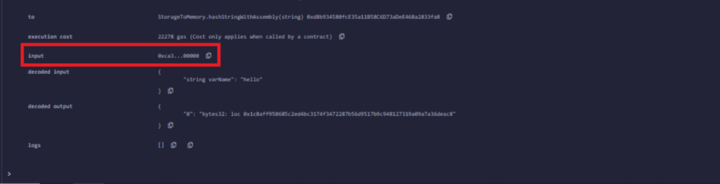
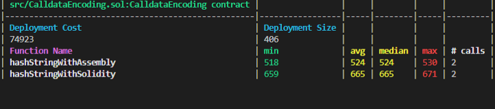

# Understanding Solidity Assembly: Hashing a String from Calldata

I recently came across a situation where I needed to hash a string in a smart contract. The “standard” way to do so would be using the built-in keccak256 function like so:

```
function hashString(string calldata stringArgument) public pure returns(string memory hashedString) {
    bytes32 hashedString = keccak256(abi.encodePacked(stringArgument));
}
```

The above is great; it is readable and compact, and the fact that it uses high level Solidity means functions like `abi.encodePacked` have been battle-tested.

However, it can be made cheaper by taking off the Solidity guardrails and manipulating the data directly with Assembly. To create a function that hashes a string, we need to understand three things:

1. Where is the string is stored when the function is invoked
2. How the string is encoded
3. What Assembly functions are needed to access and manipulate the string

The function, for reference, is below. Understanding the above points will put each line into context.

```
function hashStringWithAssembly(string calldata varName) public pure returns(bytes32 hash) {
  assembly {
    let len := calldataload(0x24)
    let ptr := mload(0x40)
    calldatacopy(ptr, add(0x24, 0x20), len)
    hash := keccak256(ptr, len)
  }
}
```

## Where the string is stored
When the function is called, the string data is passed into a storage location named calldata. This is a “non-modifiable, non-persistent area where function arguments are stored, and behaves mostly like memory” ([source](https://ethereum.stackexchange.com/questions/74442/when-should-i-use-calldata-and-when-should-i-use-memory)). This is important because Assembly requires you to specify the location that it will be pulling data from.

## How the string is encoded
For the sake of this example, let’s say the string being passed in is “hello”. Running the above code in Remix reveals how the EVM interprets this simple string as `0xca3ee1650000000000000000000000000000000000000000000000000000000000000020000000000000000000000000000000000000000000000000000000000000000568656c6c6f000000000000000000000000000000000000000000000000000000`:


Pictured: Remix terminal logs after passing in “hello” as an argument

That is a lot of bytes for “hello”! The first four bytes (`ca3ee165`) is the function signature, so those can be ignored. The [Solidity spec](https://docs.soliditylang.org/en/v0.8.17/abi-spec.html#function-selector-and-argument-encoding) reveals that strings are actually encoded as byte arrays. The first 32 bytes point to the location in calldata where the byte array begins. In this case, it is the next slot, or 0x20.

The 32 bytes that live at that pointer denotes the length of the array, in bytes. This value is 5, which matches the length of the string “hello”.

The data following the array’s length (`68656c6c6f`) is the actual array content in [UTF-8 hex encoding](https://www.charset.org/utf-8). 68 = “h”, 65 = “e”, 6c = “l”, 6f = “o”.

## Accessing calldata with Assembly
We now know the location and the shape of the data, it is time to put it all together using Assembly.

The first line locates the length of the string in the calldata and copies it to memory. Based on our understanding of the calldata encoding above, we know it is at location 0x24.

mload(0x40) gives us the [free memory pointer](https://ethereum.stackexchange.com/questions/63117/when-did-the-ethereum-free-memory-pointer-change-6060-6080), which in this case will be the location in memory immediately after the length value we just stored.

Given that we know both the length of the string and its location in calldata (0x44, or function signature [0x4] + pointer space [0x20] + length space [0x20]), the next line (`calldatacopy`) copies the calldata located at the array’s starting point for length number of bytes and stores it at the free memory pointer.

The last line is a low-level call of `keccak256`, which takes an arbitrary number of bytes and hashes them. In this case, it behaves identically to `abi.encodePacked`.

## Testing
I used Foundry to write unit tests and track gas costs, which will likely be the subject of a later piece. However, suffice it to say that the performance difference between using Assembly and high-level Solidity was significant — 20% on average.

